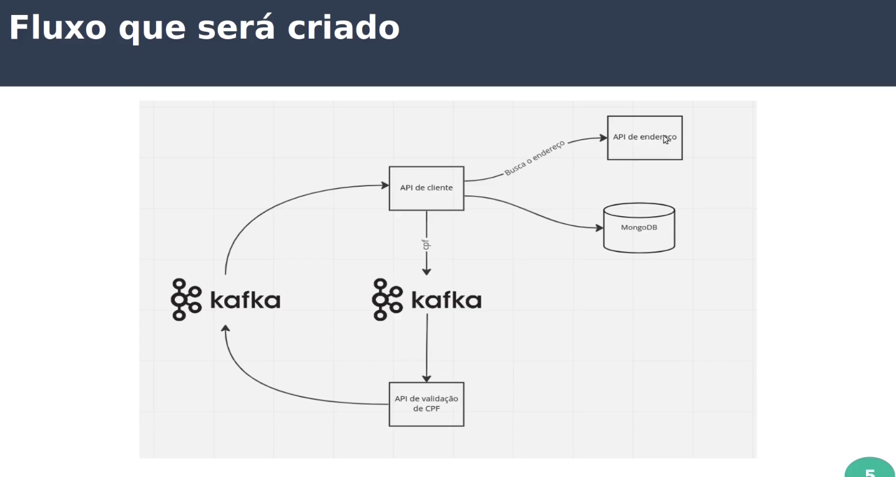

**Projeto consulta de clientes**

Este é um projeto do curso da Udemy Arquitetura Hexagonal com Kotlin NA PRÁTICA.

É um projeto para fins de estudo da aplicação da arquitetura hexagonal com linguagem Kotlin + Spring Boot.

[Explicação dos pacotes criados](./Arquitetura.md)

**Fluxo da aplicação**

**TODOs -> Funcionalidades**

- [x] Cadastro de usuários
- [x] Edição de usuários
- [x] Remoção de usuários
- [x] Leitura de usuários
- [ ] Validação de CPF
- [ ] Validação de endereço via CEP
- [ ] Deploy da aplicação no ambiente
- [ ] Cobetura de testes

